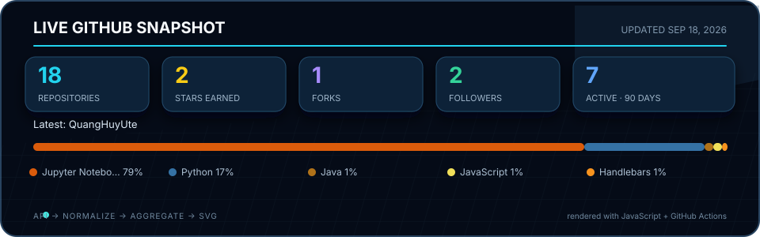

  

  
  
  

## Hello, I'm Quang Huy

I'm an AI student and builder at **HCMUTE**, interested in the space where machine learning, useful software and clear visual explanation meet.

- Building **agentic AI**, **multimodal learning** and **data-driven applications**
- Turning research ideas into auditable prototypes, dashboards and interactive demos
- Currently exploring grounded LLM reasoning, recommendation systems and human-centered AI

## What I work with

  
  
  
  
  
  
  
  
  

## Featured work

### Physics Question Answering with Qwen

An agentic, calculator-first reasoning system where routing, parsing, validation, deterministic solving and explanation have separate responsibilities. The language model helps understand and explain; verified code owns the final number, formula and unit.

[`Qwen2.5` · `LoRA` · `Schema validation` · `Deterministic solvers` →](https://github.com/QuangHuyUte/physical_questions_qwen)

---

### Acoustic–Text Speech Emotion Recognition

From an acoustic-only multi-branch model to an IEMOCAP multi-task benchmark combining speech representations, transcripts, bridge cross-attention, emotion classification and VAD regression.

[`Multimodal fusion` · `Emotion2Vec` · `NLP` · `Multi-task learning` →](https://github.com/QuangHuyUte/An-Acoustic-Text-Fusion-Approach-for-Predicting-Categorical-and-Dimensional-Speech-Emotions)

---

### PHQ-9 Clinical Intake Copilot

A narrow-scope research prototype that supports initial clinical intake: structured PHQ-9 scoring, rule-controlled follow-up, evidence-linked case scoring and three small QLoRA adapters. It does not diagnose or replace a clinician.

<table>
  <tr>
    <td width="42%"></td>
    <td width="58%"></td>
  </tr>
</table>

[`Human-centered AI` · `QLoRA` · `Rules + evidence` · `Node.js` →](https://github.com/QuangHuyUte/PHQ_9_Based_Depression_Intake_Clinical_Copilot)

---

### BM3Fusion Multimodal Recommendation

An Amazon Baby Products recommendation study extending a BM3-style backbone with sampled-negative ranking and final text–image representation fusion. The experiments compare five controlled model variants on one shared preprocessing and evaluation pipeline.

[`PyTorch` · `CLIP` · `LightGCN` · `Top-k ranking` →](https://github.com/QuangHuyUte/NCKH_BM3)

## More things I've built

<table>
  <tr>
    <td width="50%" valign="top">
      <h3><a href="https://github.com/QuangHuyUte/weighted-astar-visualizer">Weighted A* Visualizer</a></h3>
      
An interactive Pygame laboratory for A*, Weighted A*, multiple heuristics, monster costs, two-leg pathfinding and animated map editing.

      
    </td>
    <td width="50%" valign="top">
      <h3><a href="https://github.com/QuangHuyUte/Movie-Revenue-Rating-SVM-vs-XGBoost">Film Score & Revenue AI</a></h3>
      
A hybrid SVC/XGBoost/SVR pipeline for film revenue and rating prediction, including leakage control, explainability and a Streamlit inference station.

      
    </td>
  </tr>
  <tr>
    <td width="50%" valign="top">
      <h3><a href="https://github.com/QuangHuyUte/Employee_Assessment_System">Employee Assessment System</a></h3>
      
A full-stack Express, Supabase and Chart.js dashboard for employee records, assessment cycles, competency history and AI-assisted feedback.

    </td>
    <td width="50%" valign="top">
      <h3><a href="https://github.com/QuangHuyUte/Hotel_Booking_App">Hotel Booking App</a></h3>
      
A recent Java application project with a Supabase-backed data layer and a focus on practical product UI and booking workflows.

    </td>
  </tr>
</table>

## Live profile metrics

  

The card is rendered from GitHub's API by a dependency-free JavaScript script and refreshed automatically with GitHub Actions.

  
   
  <strong>Build with curiosity. Measure with care. Explain with clarity.</strong>

