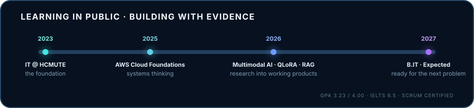

  

  
  
  
  
  

  <a href="#selected-work">Selected work</a> ·
  <a href="#toolkit">Toolkit</a> ·
  <a href="#journey">Journey</a> ·
  <a href="#live-profile-metrics">Live metrics</a>

## Hello — I'm Huy

I'm a fourth-year Information Technology student at **Ho Chi Minh City University of Technology and Education**, focused on applied AI. I enjoy the full path from a research question to a system someone can inspect, test and actually use.

<table>
  <tr>
    <td width="25%"><strong>Research</strong> Multimodal learning, SER and recommendation</td>
    <td width="25%"><strong>LLM systems</strong> QLoRA, Hybrid RAG and structured outputs</td>
    <td width="25%"><strong>Engineering</strong> APIs, data pipelines and product interfaces</td>
    <td width="25%"><strong>Collaboration</strong> Team lead and Product Owner experience</td>
  </tr>
</table>

> My rule of thumb: let models handle ambiguity; let validated code own facts, numbers and safety boundaries.

## Selected work

### 01 · Acoustic–Text Fusion for Speech Emotion Recognition

Led a three-person project that combines multi-branch acoustic features and transcripts with attention for emotion classification plus Valence–Arousal–Dominance regression. On 10-fold IEMOCAP evaluation, the system reached **74.02% WA**, **74.64% UAR**, **74.05% Macro-F1** and **0.661 mean CCC**.

[`Multimodal fusion` · `Emotion2Vec` · `Attention` · `Multi-task learning` →](https://github.com/QuangHuyUte/An-Acoustic-Text-Fusion-Approach-for-Predicting-Categorical-and-Dimensional-Speech-Emotions)

---

### 02 · PHQ-9 Depression Intake Clinical Copilot

Led a two-person, clinician-facing research prototype for structured PHQ-9 intake. It uses cue extraction, intent/fact routing, evidence retrieval, deterministic validation and three small QLoRA adapters for patient simulation, follow-up generation and keyword-cue extraction.

<table>
  <tr>
    <td width="42%"></td>
    <td width="58%"></td>
  </tr>
</table>

Research and decision-support prototype only — not a diagnostic tool or a replacement for a clinician.

[`Human-centered AI` · `QLoRA` · `Hybrid retrieval` · `Rules + evidence` →](https://github.com/QuangHuyUte/PHQ_9_Based_Depression_Intake_Clinical_Copilot)

---

### 03 · BM3Fusion Multimodal Recommendation

Extended a BM3-style backbone for Amazon Baby Products with text–image item representations, sampled-negative BPR loss and collaborative/textual/visual signal fusion. The controlled experiments achieved **Test R@20 0.0551**, **NDCG@20 0.0253** and **R@50 0.0935**.

[`PyTorch` · `CLIP` · `LightGCN` · `BPR` · `Top-k evaluation` →](https://github.com/QuangHuyUte/NCKH_BM3)

---

### 04 · Physics Question Answering with Qwen

An individual Qwen-based pipeline for preprocessing, QLoRA instruction tuning, inference and evaluation across conceptual and numerical physics questions. Routing, schema parsing and deterministic solvers keep the final formula, number and unit auditable.

[`Qwen2.5` · `QLoRA` · `Structured outputs` · `Deterministic solvers` →](https://github.com/QuangHuyUte/physical_questions_qwen)

## More things I've built

<table>
  <tr>
    <td width="50%" valign="top">
      <h3><a href="https://github.com/QuangHuyUte/weighted-astar-visualizer">Weighted A* Visualizer</a></h3>
      
An interactive Pygame laboratory for A*, Weighted A*, multiple heuristics, monster costs, two-leg pathfinding and animated map editing.

      
    </td>
    <td width="50%" valign="top">
      <h3><a href="https://github.com/QuangHuyUte/Movie-Revenue-Rating-SVM-vs-XGBoost">Film Score & Revenue AI</a></h3>
      
A hybrid SVC/XGBoost/SVR pipeline for film revenue and rating prediction with leakage control, explainability and a Streamlit inference station.

      
    </td>
  </tr>
  <tr>
    <td width="50%" valign="top"><h3><a href="https://github.com/QuangHuyUte/Employee_Assessment_System">Employee Assessment System</a></h3>
Product Owner in an eight-person Scrum team; also built layered backend modules and relational data models for role-based assessments and AI-assisted feedback.
</td>
    <td width="50%" valign="top"><h3><a href="https://github.com/QuangHuyUte/Hotel_Booking_App">Hotel Booking App</a></h3>
A Java application with a Supabase-backed data layer, practical booking workflows and product-focused UI.
</td>
  </tr>
</table>

## Toolkit

  
  
  
  
  
  
  
  

`LoRA / QLoRA` · `Hybrid RAG` · `Prompt engineering` · `Structured outputs` · `REST APIs` · `Pandas / NumPy` · `PostgreSQL / MySQL` · `Git / GitHub`

## Journey

  

## Live profile metrics

  

Rendered from the GitHub API by a dependency-free JavaScript script and refreshed automatically with GitHub Actions.

  
   
  <strong>Build with curiosity. Measure with care. Explain with clarity.</strong>
    
  <a href="mailto:huygialai2005@gmail.com">Let's build something useful together.</a>

